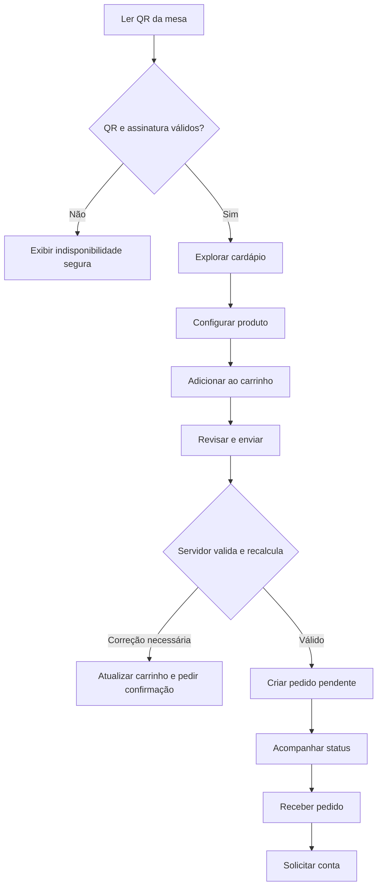
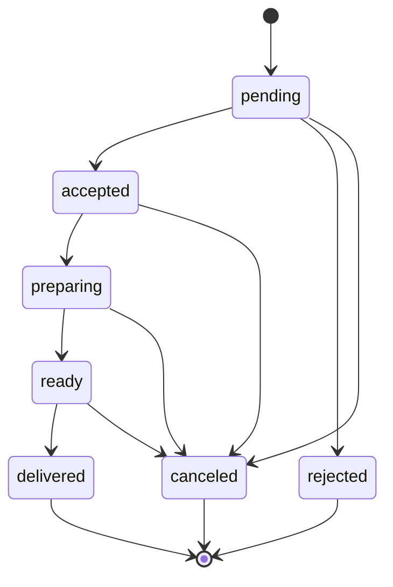
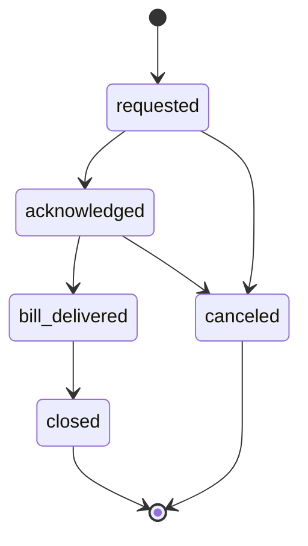
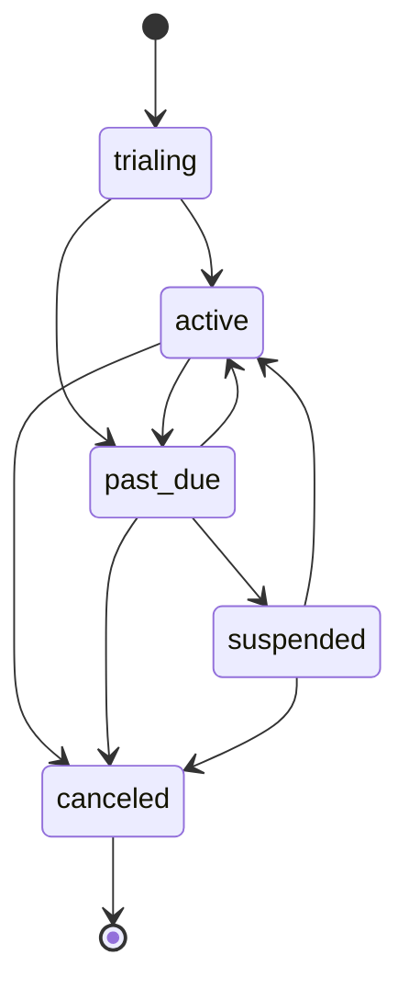
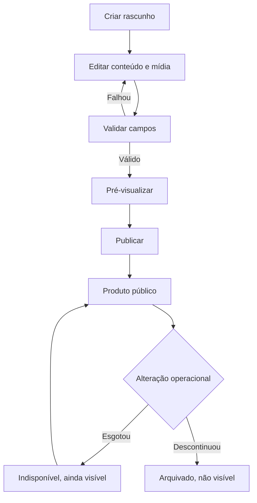

# 05 — Fluxos e máquinas de estado

## 1. Jornada principal do consumidor



## 2. Criação transacional do pedido

1. Cliente gera `client_request_id` UUID.
2. Envia token da mesa, itens, quantidades, opções e observações.
3. Servidor autentica o contexto anônimo por cookie seguro e aplica rate limit.
4. Banco resolve mesa e estabelecimento.
5. Banco bloqueia criação se tenant, assinatura ou mesa estiverem inválidos.
6. Banco verifica horário e `accepting_orders`.
7. Banco carrega produtos/opções publicados e disponíveis.
8. Banco valida regras dos grupos.
9. Banco calcula preços em centavos.
10. Se o `expected_total_cents` opcional divergir, aborta com `PRICE_CHANGED`.
11. Banco cria/reutiliza sessão aberta da mesa com restrição única.
12. Banco cria pedido, itens, opções e primeiro histórico.
13. Banco grava idempotência e retorna pedido.
14. Evento de Realtime é emitido pela inserção.

Toda a sequência de banco ocorre em uma transação. Uma falha não pode deixar pedido parcial.

## 3. Máquina de estados do pedido



### Transições e permissões

| Origem | Destino | Papéis | Motivo obrigatório |
|---|---|---|:---:|
| `pending` | `accepted` | kitchen, cashier, manager, owner | Não |
| `pending` | `rejected` | kitchen, cashier, manager, owner | Sim |
| `pending` | `canceled` | cashier, manager, owner | Sim |
| `accepted` | `preparing` | kitchen, cashier, manager, owner | Não |
| `accepted` | `canceled` | cashier, manager, owner | Sim |
| `preparing` | `ready` | kitchen, cashier, manager, owner | Não |
| `preparing` | `canceled` | cashier, manager, owner | Sim |
| `ready` | `delivered` | cashier, manager, owner | Não |
| `ready` | `canceled` | cashier, manager, owner | Sim |

Repetir a mesma transição retorna o estado atual sem duplicar histórico quando o mesmo `operation_id` for reutilizado.

## 4. Máquina de estados da solicitação de conta



- `requested`: consumidor solicitou.
- `acknowledged`: caixa visualizou e assumiu.
- `bill_delivered`: conta foi levada à mesa.
- `closed`: atendimento encerrado.
- `canceled`: solicitação cancelada pela operação com motivo.

Fechar a conta fecha a `table_service_session`, desde que não existam pedidos não terminais. Se houver, exigir resolução ou confirmação explícita de gerente/owner com auditoria.

## 5. Máquina de estados da assinatura



### Regras

- `trialing`: serviço liberado até `trial_ends_at`.
- `active`: sem pendência bloqueante.
- `past_due`: fatura vencida, mas prazo adicional ainda válido ou job ainda não processou.
- `suspended`: serviço bloqueado por inadimplência ou suspensão manual.
- `canceled`: contrato encerrado; dados preservados.

Motivo de suspensão é separado do status: `overdue`, `manual`, `fraud`, `contract_end` ou `other`.

## 6. Fluxo de publicação de produto



## 7. Fluxo do QR Code

1. Admin cria uma mesa.
2. Servidor gera token aleatório de alta entropia.
3. URL usa `slug` público e token, nunca ID sequencial.
4. Painel gera PNG e SVG.
5. QR pode ser baixado novamente.
6. Regenerar cria token novo, incrementa versão e invalida imediatamente o anterior.
7. Desativar mesa invalida o QR sem excluir históricos.

URL de referência:

```text
https://app.imenu.com.br/m/{establishmentSlug}/t/{tableToken}
```

## 8. Realtime e reconexão

1. A tela carrega snapshot por API.
2. Abre assinatura filtrada pelo `establishment_id` autorizado.
3. Evento recebido atualiza cache local.
4. Ao perder conexão, exibe indicador.
5. Ao reconectar, invalida e refaz o snapshot; não confia apenas nos eventos perdidos.
6. Polling de segurança a cada 15 segundos ocorre enquanto o painel está aberto.
7. Eventos não substituem autorização; dados são revalidados no servidor.

## 9. Fluxos de exceção

### Preço alterado

- Não criar pedido.
- Retornar os itens alterados e novo total.
- Atualizar carrinho.
- Exigir nova confirmação.

### Item esgotado

- Não criar pedido parcial.
- Identificar itens/opções indisponíveis.
- Permitir remover ou substituir.

### Duplo clique/timeout

- O segundo request com mesma chave recebe o resultado original.
- Se a resposta original foi incerta, o cliente consulta por `client_request_id`.

### Assinatura suspensa durante uso

- Próxima mutação falha com `ESTABLISHMENT_SUSPENDED`.
- Painel encerra ações operacionais e redireciona para aviso.
- Owner mantém acesso restrito à cobrança e suporte.

