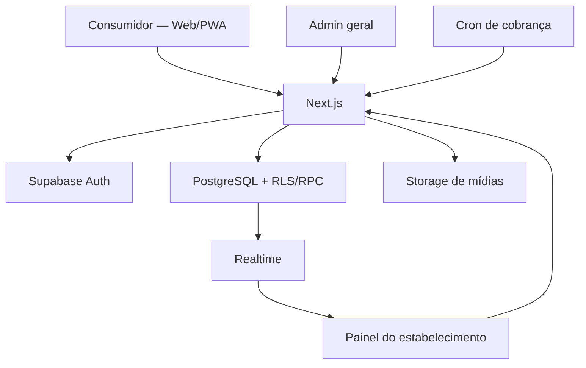

# 06 — Arquitetura técnica

## 1. Visão geral

O MVP usa um **monólito modular**: uma aplicação Next.js contém as quatro experiências, Route Handlers/Server Actions e módulos de domínio. O PostgreSQL concentra integridade, transações, RLS e funções críticas. Essa opção reduz deploys e contratos distribuídos sem misturar responsabilidades no código.



## 2. Componentes

### Next.js

- layouts e rotas;
- renderização server-first;
- endpoints públicos e autenticados;
- validação Zod;
- autorização de aplicação;
- orquestração de upload;
- geração de QR;
- rate limiting;
- logs estruturados;
- cron autenticado.

### Supabase Auth

- autenticação de funcionários e administradores;
- recuperação de senha;
- sessão via cookies seguros no servidor;
- nenhuma conta para consumidor.

### PostgreSQL

- fonte de verdade;
- isolamento multi-tenant;
- regras de integridade;
- cálculo e criação transacional do pedido;
- máquinas de estado;
- idempotência;
- auditoria e cobrança.

### Realtime

- novos pedidos;
- mudanças de status;
- solicitações de conta;
- alteração de disponibilidade.

### Storage

- logotipos e capas;
- imagens e vídeos dos produtos;
- posters/thumbnails quando disponíveis.

## 3. Módulos de domínio

| Módulo | Responsabilidade |
|---|---|
| `identity` | Perfis, autenticação e sessão |
| `tenancy` | Estabelecimentos, membros e seleção de tenant |
| `catalog` | Categorias, produtos, opções e publicação |
| `media` | Upload, validação e referências de mídia |
| `tables` | Mesas, tokens e QR Codes |
| `ordering` | Carrinho validado, pedidos, snapshots e status |
| `service-session` | Sessão da mesa e solicitação de conta |
| `operations` | KDS, disponibilidade e eventos |
| `billing` | Planos, assinatura, faturas, pagamentos e suspensão |
| `platform-admin` | Administração geral |
| `audit` | Registro de ações sensíveis |
| `shared` | Tipos, erros, moeda, datas e observabilidade |

Módulos não devem importar diretamente detalhes internos de outro módulo. Expor funções de serviço e tipos públicos.

## 4. Padrões obrigatórios

### Server-first

- Dados sensíveis e autorização no servidor.
- Componentes de cliente apenas para interatividade.
- Nunca inicializar cliente Supabase privilegiado em bundle do navegador.

### Validação em camadas

1. Zod na entrada.
2. Autorização no serviço.
3. constraints e RLS no banco.
4. função transacional para invariantes críticas.

### Dinheiro

- `integer`/`bigint` em centavos.
- Formatação apenas na apresentação.
- Não usar `float`, `double` ou cálculo monetário com ponto flutuante.

### Tempo

- `timestamptz` em UTC.
- Fuso IANA no estabelecimento, padrão `America/Sao_Paulo`.
- Número do pedido e horários de funcionamento calculados no fuso do tenant.

### Erros

Formato interno:

```ts
type AppError = {
  code: string;
  message: string;
  status: number;
  requestId: string;
  fieldErrors?: Record<string, string[]>;
  details?: Record<string, unknown>;
};
```

Resposta pública não inclui SQL, stack trace, IDs de usuário ou configuração.

### Idempotência

- `client_request_id` UUID gerado no cliente.
- restrição única por operação/contexto;
- payload hash para impedir reuso da mesma chave com conteúdo diferente;
- armazenamento do resultado ou referência.

## 5. Cliente anônimo

O QR fornece contexto da mesa, mas não identidade pessoal. O servidor cria um identificador anônimo aleatório em cookie `HttpOnly`, `Secure`, `SameSite=Lax`, com expiração curta. O hash do token pode ser persistido para relacionar pedidos desse navegador.

O token público de rastreamento do pedido:

- tem alta entropia;
- não é o UUID interno;
- é vinculado à sessão anônima;
- pode ser rotacionado/revogado;
- nunca permite consultar pedidos de outro token.

## 6. Estratégia de cache

- Conteúdo publicado do menu: cache curto de até 30 segundos, segmentado por tenant.
- Prévia administrativa: sem cache público.
- Painéis operacionais: snapshot sem cache + Realtime + polling.
- Estado de assinatura e autorização: nunca confiar em cache longo.
- Após publicar/indisponibilizar, invalidar a tag do menu do estabelecimento.

## 7. Desempenho

- Imagens responsivas e lazy load.
- Listagem usa thumbnail, não vídeo.
- Vídeo carrega metadados e poster; reprodução por ação do usuário.
- Paginação de produtos no admin e histórico de pedidos.
- Índices definidos na modelagem.
- Evitar N+1 ao montar menu e pedido.
- Queries operacionais limitadas a janela relevante, por exemplo últimas 24 horas + sessões abertas.

## 8. Dependências externas

Obrigatórias:

- Supabase.
- Hospedagem compatível com Next.js.

Opcionais/configuráveis:

- serviço de e-mail transacional;
- provedor de rate limit/Redis;
- observabilidade;
- gateway de pagamento SaaS pós-MVP.

O código deve usar adaptadores para dependências opcionais. Em desenvolvimento, falhar de forma explícita ou usar mock local documentado.

## 9. Ambientes

- `local`: Supabase local ou projeto de desenvolvimento.
- `staging`: dados fictícios e validação de deploy.
- `production`: projeto e segredos exclusivos.

Nunca compartilhar banco, bucket, chaves ou cookies entre staging e produção.

## 10. Decisões arquiteturais a registrar

Criar ADR/entrada no `status/DECISION_LOG.md` se houver mudança em:

- banco ou autenticação;
- estratégia de multi-tenancy;
- formato monetário;
- fluxo transacional de pedido;
- RLS;
- provider de cobrança;
- modelo de sessão da mesa;
- rotas públicas;
- escopo do MVP.

