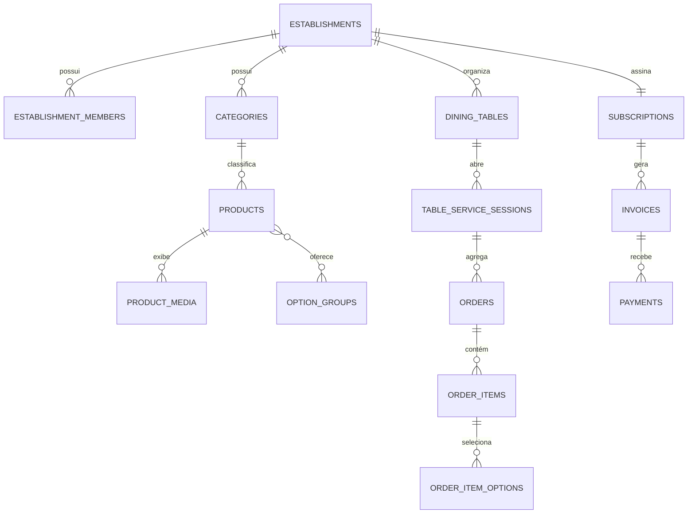

# 07 — Banco de dados, RLS e Storage

## 1. Convenções

- PostgreSQL com extensão `pgcrypto`.
- Chaves primárias UUID (`gen_random_uuid()`).
- `created_at` e `updated_at` como `timestamptz`.
- `updated_at` mantido por trigger comum.
- Nomes em `snake_case`.
- Dinheiro em `integer` ou `bigint` com sufixo `_cents`.
- Soft delete por `archived_at`/status quando houver histórico.
- Todas as tabelas multi-tenant carregam `establishment_id`.
- Índices iniciam por `establishment_id` nas consultas do tenant.

## 2. Enums sugeridos

- `member_role`: `owner`, `manager`, `menu_editor`, `kitchen`, `cashier`, `viewer`.
- `platform_role`: `super_admin`, `platform_admin`, `platform_support`.
- `product_status`: `draft`, `published`, `archived`.
- `media_kind`: `image`, `video`.
- `order_status`: `pending`, `accepted`, `preparing`, `ready`, `delivered`, `rejected`, `canceled`.
- `bill_request_status`: `requested`, `acknowledged`, `bill_delivered`, `closed`, `canceled`.
- `table_session_status`: `open`, `closed`, `canceled`.
- `subscription_status`: `trialing`, `active`, `past_due`, `suspended`, `canceled`.
- `invoice_status`: `draft`, `open`, `paid`, `overdue`, `void`.
- `payment_status`: `confirmed`, `reversed`.
- `suspension_reason`: `overdue`, `manual`, `fraud`, `contract_end`, `other`.

## 3. Tabelas de identidade e tenancy

### `profiles`

| Coluna | Tipo | Regra |
|---|---|---|
| `id` | uuid | PK e FK `auth.users.id` |
| `display_name` | varchar(120) | obrigatório |
| `email` | citext/text | espelho normalizado |
| `is_active` | boolean | padrão true |
| timestamps | timestamptz | obrigatórios |

### `platform_admins`

| Coluna | Tipo | Regra |
|---|---|---|
| `user_id` | uuid | PK/FK profile |
| `role` | platform_role | obrigatório |
| `is_active` | boolean | padrão true |
| `created_by` | uuid | admin responsável |
| timestamps | timestamptz | obrigatórios |

### `establishments`

Campos principais:

- `id`, `legal_name`, `trade_name`, `slug` único;
- `document_number` normalizado e único quando informado;
- `owner_contact_name`, `email`, `phone`;
- endereço estruturado e cidade/UF;
- `timezone`, padrão `America/Sao_Paulo`;
- `currency`, padrão `BRL`;
- `logo_path`, `cover_path`;
- `is_active`;
- `accepting_orders`;
- `manual_suspended_at`, `manual_suspension_reason`;
- timestamps.

### `establishment_members`

- `id`;
- `establishment_id`;
- `user_id`;
- `role`;
- `is_active`;
- `invited_by`;
- timestamps;
- único `(establishment_id, user_id)`.

### `member_invites`

- tenant, e-mail normalizado, papel;
- `token_hash`, `expires_at`, `accepted_at`, `revoked_at`;
- remetente e timestamps;
- nunca persistir token bruto.

## 4. Tabelas de cardápio

### `categories`

- tenant;
- `name`, `description`;
- `sort_order`;
- `is_active`;
- `archived_at`;
- índice `(establishment_id, is_active, sort_order)`.

### `products`

- tenant e `category_id`;
- `name`, `slug` único por tenant;
- `short_description`, `description`;
- `ingredients` `text[]`;
- `allergens` `text[]`;
- `nutrition` `jsonb` opcional;
- `base_price_cents` com check `>= 0`;
- `status`;
- `is_available`;
- `sort_order`;
- `published_at`, `archived_at`;
- timestamps.

### `product_media`

- tenant e `product_id`;
- `kind`;
- `storage_path`;
- `poster_path` opcional;
- `alt_text`;
- `mime_type`, `size_bytes`;
- `sort_order`;
- `is_primary`;
- único parcial: uma mídia primária por produto;
- exclusão do objeto somente após remover referência com segurança.

### `option_groups`

- tenant;
- `name`;
- `min_select`, `max_select` com checks coerentes;
- `is_active`;
- `sort_order`.

### `options`

- tenant e `option_group_id`;
- `name`;
- `price_delta_cents >= 0`;
- `is_available`;
- `sort_order`.

### `product_option_groups`

- tenant, `product_id`, `option_group_id`, `sort_order`;
- único por produto/grupo;
- trigger/constraint lógica garante que todos pertençam ao mesmo tenant.

### `business_hours`

- tenant;
- `weekday` 0–6;
- `opens_at`, `closes_at`;
- `is_closed`;
- suportar uma janela por dia no MVP.

### `business_hour_exceptions`

- tenant;
- `date`;
- `opens_at`, `closes_at`, `is_closed`, `note`;
- único por tenant/data.

## 5. Mesas e sessões

### `dining_tables`

- tenant;
- `name`/`number`;
- `public_token` aleatório único e não sequencial;
- `token_version`;
- `is_active`;
- `sort_order`;
- timestamps;
- único `(establishment_id, name)`.

O token não deve aparecer em respostas genéricas nem em logs.

### `table_service_sessions`

- tenant e `table_id`;
- `status`;
- `opened_at`, `closed_at`, `closed_by`;
- `public_reference`;
- índice único parcial para uma sessão `open` por mesa.

### `guest_sessions`

- tenant, mesa e sessão de atendimento opcional;
- `token_hash`;
- `last_seen_at`, `expires_at`;
- nenhum dado pessoal obrigatório.

## 6. Pedidos

### `orders`

- tenant, `table_id`, `table_service_session_id`;
- `guest_session_id`;
- `order_number`;
- `order_business_date` calculada no fuso do estabelecimento;
- `public_tracking_token_hash`;
- `client_request_id`;
- `payload_hash`;
- `status`;
- `subtotal_cents`, `total_cents`;
- `currency`;
- `notes` opcional;
- `rejection_reason`, `cancellation_reason`;
- timestamps de cada marco;
- único `(establishment_id, client_request_id)`;
- único `(establishment_id, order_number, order_business_date)`.

### `order_items`

- tenant, pedido;
- `product_id` anulável para preservar histórico;
- `product_name_snapshot`;
- `unit_base_price_cents`;
- `quantity`;
- `notes`;
- `unit_total_cents`;
- `line_total_cents`;
- `product_snapshot` `jsonb`.

### `order_item_options`

- tenant, item;
- `option_id` anulável;
- `group_name_snapshot`, `option_name_snapshot`;
- `unit_price_delta_cents`;
- `option_snapshot` `jsonb`.

### `order_status_history`

- tenant, pedido;
- `from_status`, `to_status`;
- `actor_user_id` anulável para ação do sistema;
- `reason`;
- `operation_id` para idempotência;
- `created_at`;
- único `(order_id, operation_id)`.

### `bill_requests`

- tenant, mesa, sessão de atendimento;
- `status`;
- `requested_by_guest_session_id`;
- timestamps de cada marco;
- `handled_by`;
- `cancellation_reason`;
- índice único parcial para solicitação ativa por sessão.

## 7. Cobrança

### `plans`

- `name`, `code` único;
- `price_cents`, `billing_interval_months`;
- `limits` `jsonb`;
- `features` `jsonb`;
- `is_active`;
- timestamps.

### `subscriptions`

- tenant único;
- `plan_id`;
- `status`;
- `current_period_start`, `current_period_end`;
- `trial_ends_at`;
- `grace_until`;
- `suspended_at`, `suspension_reason`, `suspension_note`;
- `canceled_at`;
- provider/código externo anuláveis para futuro;
- `version` para concorrência.

### `invoices`

- tenant e subscription;
- `reference_period_start`, `reference_period_end`;
- `amount_cents`, `currency`;
- `status`;
- `issued_at`, `due_at`, `paid_at`, `voided_at`;
- `external_reference`;
- único por assinatura e período.

### `payments`

- tenant, invoice;
- `amount_cents`;
- `status`;
- `paid_at`, `method`, `reference`;
- `recorded_by`;
- `reversed_at`, `reversed_by`, `reversal_reason`;
- timestamps.

### `subscription_events`

Histórico imutável: status anterior/novo, evento, motivo, ator e metadados.

## 8. Auditoria e suporte

### `audit_logs`

- `actor_user_id`;
- `actor_scope` (`platform`, `establishment`, `system`);
- `establishment_id` opcional;
- `action`;
- `resource_type`, `resource_id`;
- `before_data`, `after_data` sanitizados;
- `request_id`;
- `ip_hash` opcional;
- `created_at`.

Não guardar senha, token, cookie, chave, corpo completo de cartão ou segredo.

### `idempotency_records`

- `scope`, tenant opcional;
- `key`, `payload_hash`;
- `resource_type`, `resource_id`;
- `response_code`;
- `expires_at`;
- único por escopo/chave.

## 9. Relações principais



## 10. Funções de banco obrigatórias

As assinaturas exatas podem variar, mas devem existir operações transacionais equivalentes:

- `create_public_order(...)`;
- `transition_order_status(...)`;
- `request_table_bill(...)`;
- `transition_bill_request_status(...)`;
- `publish_product(...)`;
- `evaluate_establishment_access(establishment_id)`;
- `process_overdue_subscriptions(now)`;
- `confirm_invoice_payment(...)`;
- `reverse_payment(...)`.

Funções privilegiadas:

- `security definer`;
- `search_path` fixo;
- revogar execução de `public`;
- conceder apenas ao papel necessário;
- validar tenant, papel e estado internamente.

## 11. RLS

### Princípios

1. RLS ativa e forçada em todas as tabelas de negócio.
2. Usuário autenticado acessa tenant apenas se membro ativo.
3. Escrita exige papel autorizado.
4. Administrador da plataforma usa políticas separadas.
5. Acesso público ao menu não consulta tabelas diretamente; passa por endpoint/RPC de leitura limitada.
6. Service role somente em código server-side controlado.

### Helpers sugeridos

- `is_active_member(establishment_id)`;
- `has_tenant_role(establishment_id, allowed_roles[])`;
- `is_platform_admin(allowed_roles[])`.

Evitar recursão de RLS: helpers devem ser cuidadosamente definidos e testados.

### Testes mínimos de RLS

- owner A não lê produtos/pedidos B;
- kitchen A não edita produto A;
- menu_editor A não muda pedido A;
- cashier A não acessa assinatura B;
- support não confirma pagamento;
- usuário removido perde acesso;
- anon não seleciona tabelas internas;
- QR inválido não revela cadastro.

## 12. Índices mínimos

- membros: `(user_id, is_active)`, `(establishment_id, role, is_active)`;
- produtos: `(establishment_id, status, is_available, category_id, sort_order)`;
- mesas: `(establishment_id, public_token)`;
- sessões: `(establishment_id, table_id, status)`;
- pedidos: `(establishment_id, status, created_at desc)`;
- pedidos: `(table_service_session_id, created_at)`;
- histórico: `(order_id, created_at)`;
- solicitações: `(establishment_id, status, created_at desc)`;
- faturas: `(establishment_id, status, due_at)`;
- assinaturas: `(status, current_period_end, grace_until)`;
- auditoria: `(establishment_id, created_at desc)` e `(actor_user_id, created_at desc)`.

Confirmar índices com `EXPLAIN` nas consultas críticas.

## 13. Storage

Buckets lógicos:

- `brand-media`: logos e capas;
- `menu-media`: imagens, vídeos e posters.

Padrão de caminho:

```text
{establishment_id}/products/{product_id}/{uuid}.{ext}
```

Regras:

- upload apenas por membro autorizado;
- validação de MIME real e tamanho no servidor;
- nome fornecido pelo usuário nunca vira caminho direto;
- objetos de tenant A não podem ser escritos por tenant B;
- conteúdo publicado pode ser servido ao público;
- rascunhos não devem ser descobertos por listagem pública;
- remoção física somente após confirmar ausência de referências;
- usar poster/thumbnail e cabeçalhos de cache adequados.
